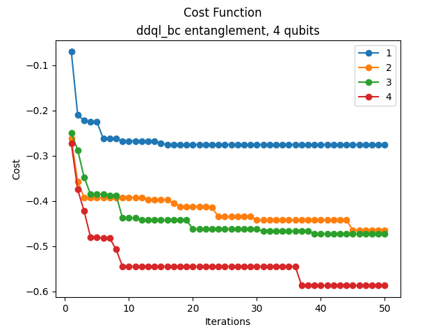
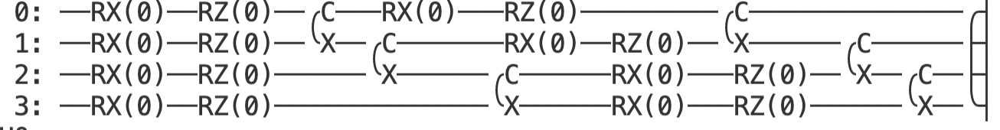
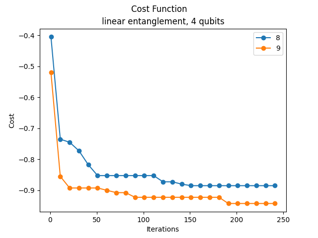

# Variational State Transformation  
In this project, we fix 4 4-qubit target states and corresponding input states, and train a parametrized quantum circuit such that applying the circuit to the *i*th input state produces the *i*th output state, or a state as close as possible. This project uses [PennyLane](https://www.pennylane.ai).

## Usage
Install libraries in *requirements.txt*. To run the program in default mode, use the command:
```bash
python main.py
```
Change the number of qubits by changing 'num_qubits' in *state_generation.py*. Currently, only 1, 2, and 4-qubits are supported with 1,2,4 specified target states. 
```python
# Set the number of qubits to use
num_qubits = 4
```
Change backend and optimizer in *vst.py* and all other parameters in *main.py.* 

## Task 
*This project is for the QOSF mentorship program. The following is the description of the task.*

Prepare 4 random 4-qubit quantum states of your choice.
Create and train a variational circuit that transforms input states into predefined output states. Namely
* if random state 1 is provided, it returns state |0011>
* if random state 2 is provided, it returns state |0101>
* if random state 3 is provided, it returns state |1010>
* if random state 4 is provided, it returns state |1100>

What would happen if you provided a different state? Analyze and discuss the results.

Feel free to use existing frameworks (e.g. PennyLane, Qiskit) for creating and training the circuits.
This PennyLane demo can be useful: Training a quantum circuit with Pytorch, This Quantum Tensorflow tutorial can be useful: Training a quantum circuit with Tensorflow .

For the variational circuit, you can try any circuit you want. You can start from one with a layer of RX, RY and CNOTs, repeated a couple of times (though there are certainly better circuits to achieve this goal). 

Context:
This challenge has been inspired by the following papers “A generative modeling approach for benchmarking and training shallow quantum circuits” and “Generation of High-Resolution Handwritten Digits with an Ion-Trap Quantum Computer“. The target states of this task can be interpreted as the 2x2 “bars and stripes” patterns used in the first paper.

## Overview of Files
* *main.py* to set parameters and run the model.
* *vst.py* includes the VariationalStateTransformation class which is used to define, train, test, track, update, and write the model. 
* *state_generation.py* defines the number of qubits, and has a function to define the target states and a function to generate the random parameters used in preparing the arbitrary input states.  
* *plot.py* has a function used to plot the cost function against the number of iterations. 
* *plots* includes different cost function plots.
* *results.csv* keeps track of result parameters.   
* *requirements.txt* lists libraries required. 
* *images* includes images, specifically of the circuit structure. 

## Methods and Model Description
The first step is to create the target states, specifically the four target states given in the task, and the corresponding number of random fixed input (pure) states. Input states are created by generating random parameters, then feeding them to PennyLane's *ArbitraryStatePreparation*. 
```python
qml.templates.ArbitraryStatePreparation(input_state, wires=list(range(self.num_qubits)))
```
In addtion to the input and target states, the model takes in other parameter choices such as the circuit structure, number of layers, number of iterations, and how often to record the cost. 
```python
class VariationalStateTransformation():
    def __init__(self, 
            input_states,
            target_states,
            circuit_structure='linear', 
            num_layers=2, 
            iterations=1,
            step_record=1
        ):
```      
Currently, the optimizer is fixed as *RotosolveOptimizer,* chosen because it's gradient-free. 
The method 'layer' defines several different circuit structures, including 'ddql_bc' which is figure 8.b,c circuits from [“A generative modeling approach for benchmarking and training shallow quantum circuits”](https://www.nature.com/articles/s41534-019-0157-8). Once the circuit is defined, it can be executed and measured with a probabilty measurement or an expected value with the output state density operator as the Hermitian operator. 
```python
# Measure expectation value wrt output state density matrix 
@qml.qnode(dev)
def expval_measurement(params, input_state, output_state):
    # Circuit
    self.circuit_gates(params, input_state)
    # Measurement     
    return qml.expval(qml.Hermitian(output_state, wires=range(self.num_qubits)))
```
To train the circuit, the optimizer minimizes a defined cost function, which in this case was the negative average output of the circuit for the input states.  The final step is to compare the results and write them to file, as well as plot them. 

## Results
All figures were gathered by running code on PennyLane's "default.qubit" simulator. This code was tested on IBM Quantum Experience, but just to verify compatibiltily.  

The first plot shows the ddql circuit structure as defined in [“A generative modeling approach for benchmarking and training shallow quantum circuits”](https://www.nature.com/articles/s41534-019-0157-8). There is a clear trend that increasing the number of layers increases performance, even with the same number of iterations. This trend was true for all circuit structures explored. 




The linear circuit out-performed the other circuits, when compared with the same number of layers and iterations. The following depicts two layers of the linear circuit. 



In this chart we show number of layers from 4 to 7 depicting good performance.


The best performance was with 9 layers, which had an average of 94% fidelity accross the states.



Note also that when random states different from the fixed input states are fed into the circuit, the fidelity is low. 

## Next Steps
* There are still more circuits to try. For instance, being more selective with the qubits entangled or dynamically updating the structure. Increasing the layers increased the fidelity, however, it also increased the circuit depth substantially, which is not practical. 
* There are also other ways of defining the cost function to consider. The *negative log-likelihood* was tested, but the other cost model was more effective. 
* The goal of this code was to be as flexible as possible. One aspect that is rigid is selecting the number of qubits and input states. The code has potential for flexibility, but it's incomplete.
*  Finally, another next step would be to test these circuits on  quantum devices. The code was run on IBMQ to test it, but only for verification (1 iteration was used) due to queue times. A next step would be to get meaningful results using quantum hardware. 

## Sources
* [PennyLane](https://www.pennylane.ai)
* [IBM Quantum](https://quantum-computing.ibm.com/)
* [“A generative modeling approach for benchmarking and training shallow quantum circuits”](https://www.nature.com/articles/s41534-019-0157-8)
* https://pennylane.ai/qml/demos/tutorial_data_reuploading_classifier.html
* https://pennylane.ai/qml/demos/tutorial_state_preparation.html
